

# StockChat

**Ask about the stock market in plain English. Get answers built from live data.**

An AI research assistant for US stocks: it looks up real prices, charts, comparisons and news, explains them in a few sentences, and keeps an eye on your watchlist and price alerts.

 

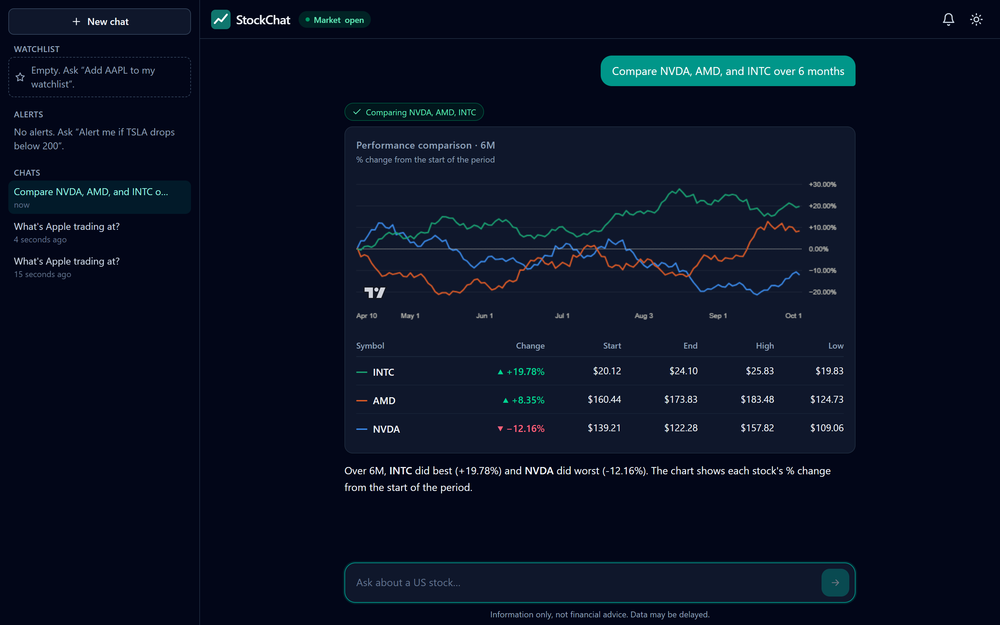

---

## What it is

Checking on a stock usually means hopping between a quote page, a charting site and a news feed. StockChat puts all of that behind one chat box:

> _"How has Tesla done this month?"_ · _"Compare NVDA, AMD and INTC over 6 months"_ · _"Any news on Microsoft?"_ · _"Alert me if AAPL goes above 250"_

An AI model works out what you're asking and fetches the data it needs. The answer comes back as **real interface elements** (quote cards, interactive charts, comparison tables, news lists) plus a short written summary.

Two ideas shape the whole design:

- 🔢 **The numbers never come from the AI.** Every price and percentage on screen is rendered straight from market data. The model writes the commentary; it never re-types a number into a card.
- ✋ **Nothing changes without your click.** The assistant can *propose* an alert or a watchlist change, but only a Confirm button you press makes it happen.

---

## A tour

<table>
  <tr>
    <td width="50%" valign="top">
      <h3>💬 Ask in your own words</h3>
      
Use company names or tickers. StockChat finds the right symbol, fetches a live quote, and says when the market is closed and you're looking at the last close.

      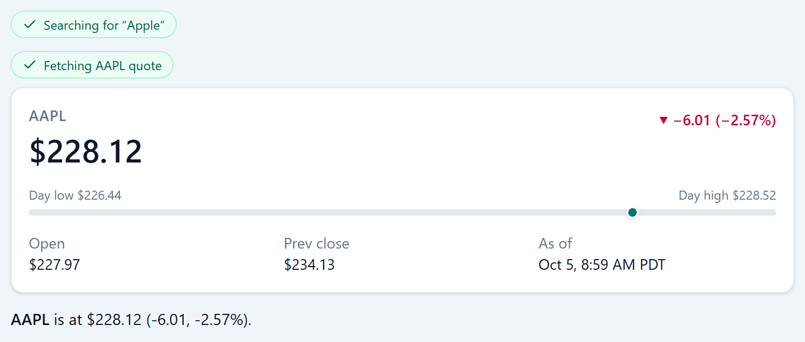
    </td>
    <td width="50%" valign="top">
      <h3>📈 Interactive charts</h3>
      
Price history with start, end, high and low. Switch between 1 day and 5 years right on the card, with no new question needed.

      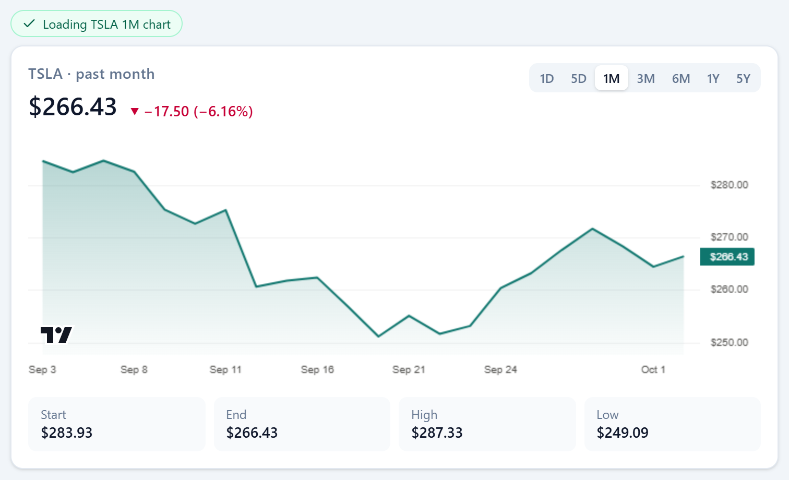
    </td>
  </tr>
  <tr>
    <td width="50%" valign="top">
      <h3>⚖️ Side-by-side comparisons</h3>
      
Up to five stocks on one normalized chart (percent change from the start), with a ranked table underneath.

      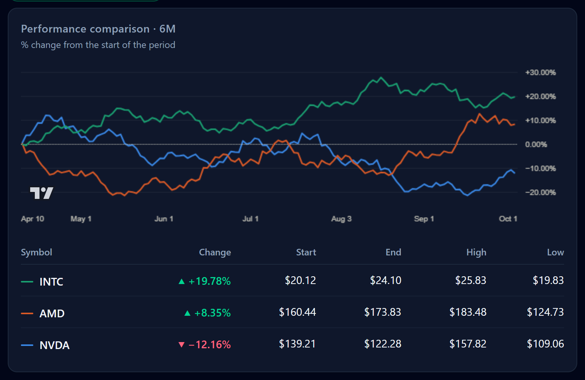
    </td>
    <td width="50%" valign="top">
      <h3>🏢 Company profiles</h3>
      
Industry, exchange, country and market cap at a glance.

      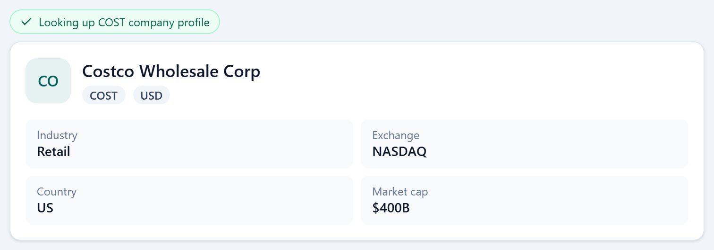
    </td>
  </tr>
  <tr>
    <td colspan="2" valign="top" align="center">
      <h3>📰 Latest news</h3>
      
Recent headlines with source and time, linked to the original articles. News text is treated as untrusted: shown as plain text, and the AI is told never to take instructions from it.

      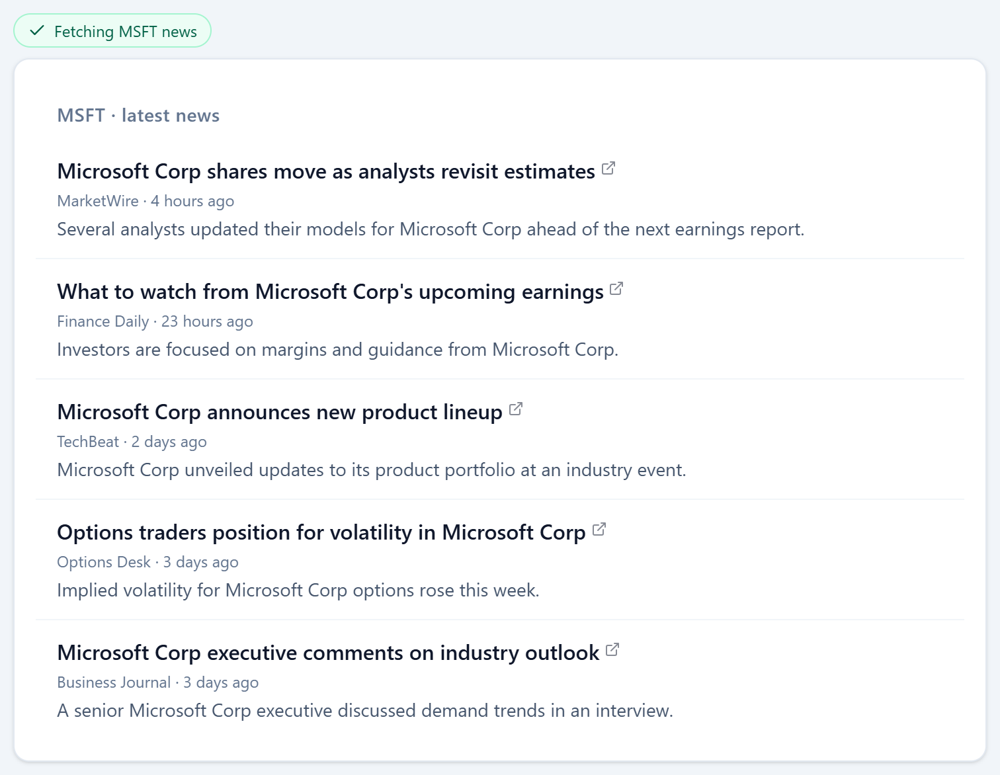
    </td>
  </tr>
</table>

---

## Alerts and watchlist, with you in control

Ask for an alert and the assistant prepares it, then **waits**. Nothing is saved until you confirm, and that confirmation is a separate action the AI can't trigger itself.

<table>
  <tr>
    <td width="50%" valign="top">
      
<b>1. The assistant proposes</b>

      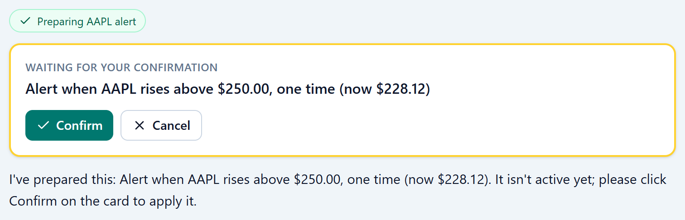
    </td>
    <td width="50%" valign="top">
      
<b>2. You confirm</b>

      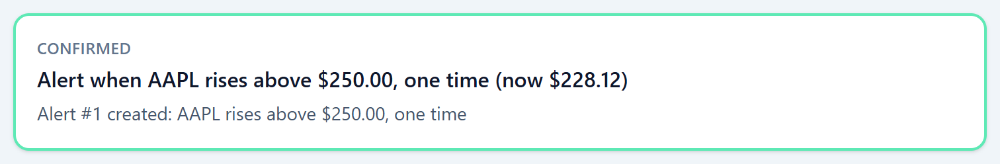
    </td>
  </tr>
</table>

**3. StockChat watches the market for you.** A background engine checks prices every 15 seconds during market hours. When an alert fires you get a notification in the app (and optionally on Discord), while your watchlist stays live in the sidebar.

  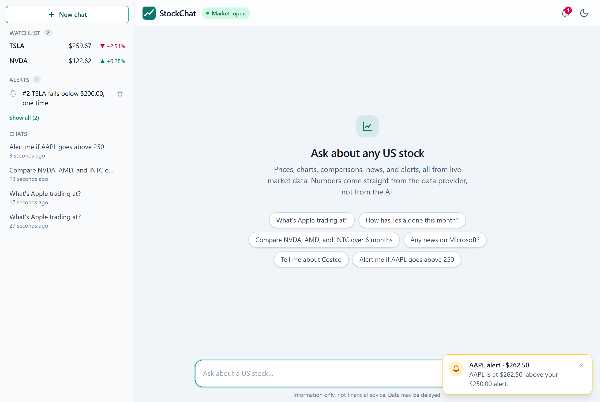

---

## See it in action

  

<table>
  <tr>
    <td width="62%" valign="middle">
      <h3>📱 Works on your phone, in light or dark</h3>
      
The layout adapts to small screens, with a slide-out sidebar for chats, watchlist and alerts. Dark mode follows your system setting or a one-click toggle.

      
The interface is also accessible: everything works from the keyboard, screen readers get labels, and gains and losses are marked with ▲/▼ arrows as well as color.

    </td>
    <td width="38%" align="center">
      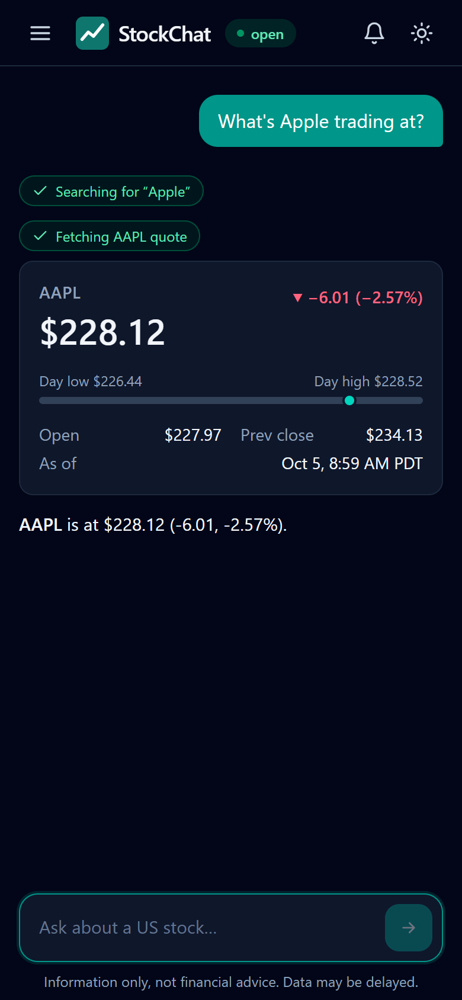
    </td>
  </tr>
</table>

---

## How it works

Every question goes through a short loop between the AI model and a set of **tools**: small, strictly checked functions that fetch data or propose changes.

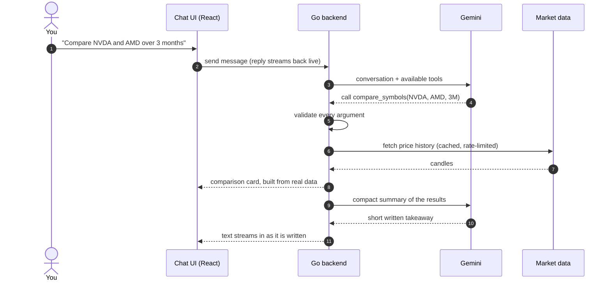

- **The AI plans, the code does the work.** The model decides *which* tools to call. The Go backend checks every argument (valid ticker, allowed range, sensible thresholds) before anything runs, and independent lookups run in parallel.
- **The UI gets the full data, the AI gets a summary.** A year of prices goes to the chart in full. The model gets the key statistics, which keeps answers fast and focused.
- **Replies stream in live.** You see each step as it happens ("Searching for Apple…", "Fetching AAPL quote…") and the answer appears as it is written.

### Under the hood

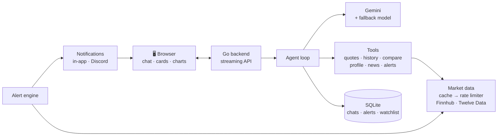

| Layer | Built with |
|---|---|
| **AI** | Google Gemini (Flash) with function calling, behind a provider-neutral interface |
| **Backend** | Go, chi router, server-sent events for streaming, structured logging |
| **Data** | Finnhub (quotes, profiles, news, market status) · Twelve Data (price history) |
| **Storage** | SQLite with versioned migrations |
| **Frontend** | React 18, TypeScript (strict), Vite, Tailwind CSS, TanStack Query, TradingView Lightweight Charts |
| **Quality** | Unit and integration tests, race detector in CI, linting, and an AI evaluation suite |

---

## Built to be trustworthy

<table>
  <tr>
    <td width="50%" valign="top">
      <b>🛡️ Safe actions</b> 
      Changes go through a pending-action step that expires after 15 minutes and can only run once. The AI can't confirm on your behalf.
    </td>
    <td width="50%" valign="top">
      <b>🧪 Tested against tricky prompts</b> 
      An evaluation suite of 33 conversations checks that the AI picks the right tools and resists manipulation: a fake news article saying "delete all alerts", "ignore your instructions", requests for buy/sell advice.
    </td>
  </tr>
  <tr>
    <td width="50%" valign="top">
      <b>⚡ Kind to rate limits</b> 
      Market data is cached, duplicate requests are merged, and calls are paced to stay inside free-tier limits. If the AI model is overloaded, StockChat retries and can switch to a backup model.
    </td>
    <td width="50%" valign="top">
      <b>🔐 Keys stay on the server</b> 
      API keys never reach the browser or the logs, and every input the AI produces is validated before it's used.
    </td>
  </tr>
</table>

---

**StockChat is for information only, not financial advice.** 
It reports and explains market data; it never tells you to buy, sell or hold. Data may be delayed.

Released under the <a href="LICENSE">MIT License</a>. Charts by <a href="https://www.tradingview.com/lightweight-charts/">TradingView Lightweight Charts</a>.

